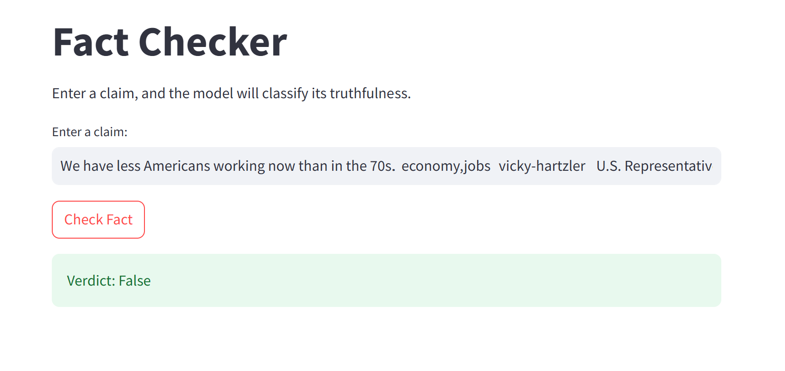

# Fact-Checker: NLP-Based Claim Verification System

This project implements a fact-checking system that classifies the truthfulness of claims using the LIAR dataset. It uses a transformer-based model for classification and provides responses based on the predicted label.

## Dataset
The system is trained on the **LIAR dataset**, which consists of labeled political claims. The dataset contains six categories:
- Pants on Fire
- False
- Barely True
- Half True
- Mostly True
- True

The dataset can be downloaded from [LIAR Dataset](https://www.cs.ucsb.edu/~william/data/liar_dataset.zip).

## Project Steps

### 1. Data Preprocessing
- Loaded `train.tsv` and `valid.tsv` using Pandas.
- Mapped string labels to numerical values for model training.
- Removed any rows with missing or invalid labels.

### 2. Model Selection & Training
- Used a transformer-based model from Hugging Face (`distilbert-base-uncased`).
- Tokenized text data for input compatibility with the model.
- Fine-tuned the model using PyTorch.

### 3. Model Evaluation
- Predicted truthfulness labels on the validation set.
- Calculated `accuracy_score` and `classification_report` from `sklearn`.

### 4. Command-Line Interface (CLI)
- Implemented a simple CLI where users can input a claim.
- The system returns a classified response indicating whether the claim is true or false.

### 5. Streamlit Web App (Bonus)
- Built a basic web interface using **Streamlit** for user-friendly interaction.
- Users can enter a claim and receive a classification response.

## Demo

## Evaluation

The system's performance was evaluated using:

- **Accuracy Score**: Measures overall correctness.
- **Classification Report**: Precision, recall, and F1-score for each class.
- **Error Analysis**: Analyzed misclassified claims to identify model weaknesses.

## Future Improvements

- Improve accuracy by experimenting with different transformer models.
- Use more context-aware fact-checking strategies.
- Implement external knowledge sources (e.g., Wikipedia, news articles).

